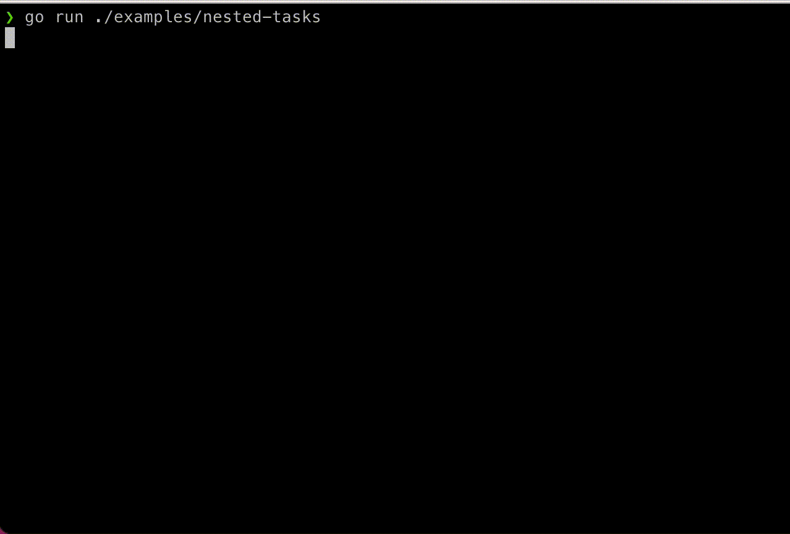

# golist



[](https://pkg.go.dev/github.com/a-poor/golist)
[](https://pkg.go.dev/github.com/a-poor/golist)


[](https://goreportcard.com/report/github.com/a-poor/golist)
[](https://sourcegraph.com/github.com/a-poor/golist?badge)
[](https://codecov.io/gh/a-poor/golist)

_created by Austin Poor_

A terminal task-list tool for Go. Inspired by the Node package [listr](https://www.npmjs.com/package/listr) and the [AWS Copilot CLI](https://github.com/aws/copilot-cli).

Check out the documentation [here](https://a-poor.github.io/golist)! _NOTE: The docs site is slightly out of date since some cool new features have been added! Check out this README for updated info and then check back with the docs later!_

In a rush? Check out the [Example](##Example) section or the [Examples](./examples) directory!

## Features
* Multi-line updating lists print to the console
* Status updates live (with spinners while processing)
* Nested task groups
* Optionally run tasks concurrently
* Check if tasks should be skipped or should fail
* Safely print to stdout while the list is being displayed
* Update the task's message while running
* Truncate text output
* Optionally expand/collapse a task-group's subtasks when not running
* Optionally skip remaining tasks if one fails in a list or sub-group

## Installation

```sh
go get github.com/a-poor/golist
```

## Dependencies

* Standard library
* [Go-MultiError](https://github.com/hashicorp/go-multierror), for returning multiple sub-task errors

## Example

Here's a quick example of `golist` in action:

```go
// Create a new list
l := golist.NewList()

// Add some tasks
l.AddTask(golist.NewTask("Get a pen", func(c golist.TaskContext) error {
    time.Sleep(time.Second)
    return nil
}))
l.AddTask(golist.NewTask("Get some paper", func(c golist.TaskContext) error {
    time.Sleep(time.Second)
    return nil
}))
l.AddTask(golist.NewTask("Write a novel", func(c golist.TaskContext) error {
    time.Sleep(time.Second)
    return nil
}))

// Run the tasks
l.RunAndWait()
```

Check out the [examples](./examples) folder for more examples of `golist` in action!

## License

[MIT](./LICENSE)

## Contributing

Pull requests are super welcome! For major changes, please open an issue first to discuss what you would like to change. And please make sure to update tests as appropriate.

Or... feel free to just open an issue with some thoughts or suggestions or even just to say Hi and tell me if this library has been helpful!

