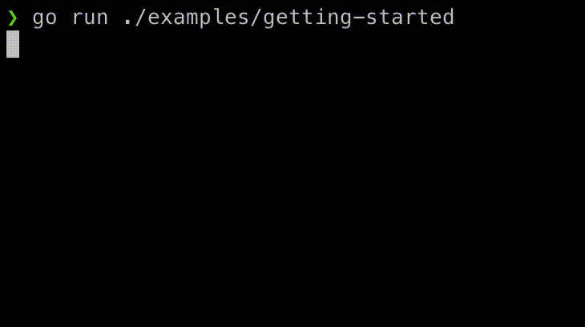

# Getting Started



Let's walk though a quick example to get started with `golist`. In our example, we'll be using `golist` to track our progress through the steps required for us to write a novel.

## Create a List

Start off by creating a `List`:

```go
l := golist.NewList()
```

The `NewList` function will create a list with some sensible defaults. You can then change the parameters or create a new `List` from scratch.

For starters, the key parameters of the `List` are:

* `Writer`: An `io.Writer` telling the `List` where to send it's output. This will most-likely be `os.Stdout`
* `Delay`: An instance of `time.Duration` telling the `List` how often to print an update of the list status
* `StatusIndicator`: A map of `TaskStatuses` to `Indicators` telling the `List` what spinner or icon to use when displaying the list status

Our default list will print to stdout every 100 milliseconds, and use the [default status indicator](https://pkg.go.dev/github.com/a-poor/golist#CreateDefaultStatusIndicator).

Now that we've created a list, we can start to add some `Tasks`!

## Adding a Task

Like the `List`, `Task`s can be created from scratch or with a factory function, `NewTask`. We'll start with the factory function:

```go
l.AddTask(golist.NewTask("Get a pen", func(c golist.TaskContext) error {
    // Write code here to "get a pen"...
    time.Sleep(time.Second)

    // It worked! No error to return.
    return nil
}))
```

The two key properties of a task are the `Message` and the `Action`. The `Message` is the text displayed as our list runs. The `Action` is the code to executed when the `Task` is run.

In our example, the `Message` for the first step in writing our novel is to "Get a pen".

The `Action` function takes a `TaskContext` as an argument and returns an `error`. We'll come back to the `TaskContext` later, but it's a way for the `Action` function to interface with its `Task` (you can read more about it [here](https://pkg.go.dev/github.com/a-poor/golist#TaskContext)).

When the `Action` function is completed, if it returns a non-`nil`-`error`, the `Task` will be marked as failed, otherwise, it will be marked as successfully completed.

## Adding Groups of Tasks

Now let's add a few more `Task`s to our `List`, grouped together in `TaskGroup`s.

A `TaskGroup` is a nested collection of `Task`s or other `TaskGroup`s. We can create `TaskGroup`s, again, either from scratch or with a factory function. The factory function takes a `Message` and a slice of `TaskRunner`s as arguments. 

`TaskRunner` is an interface that's implemented by both `Task`s and `TaskGroup`s (read more [here](https://pkg.go.dev/github.com/a-poor/golist#TaskRunner)).

```go
l.AddTask(golist.NewTaskGroup("Get some paper", []golist.TaskRunner{
    golist.NewTaskGroup("Drive to the store", []golist.TaskRunner{
        golist.NewTask("Leave the driveway", doSomething),
        golist.NewTask("Make some turns", doSomething),
        golist.NewTask("Enter the store's parking lot", doSomething),
    }),
    golist.NewTask("Get a box of paper", doSomething),
}))
```

Here we're adding a group of tasks ("Get some paper") with two sub-tasks. 

The first ("Drive to the store") is _also_ a `TaskGroup` with three of its own subtasks ("Leave the driveway", "Make some turns", and "Enter the store's parking lot"). 

The second is a regular `Task` ("Get a box of paper").

## Running the List

Great! Now our novel is almost written!

Let's add one final task...

```go
l.AddTask(golist.NewTask("Write a novel", func(c golist.TaskContext) error {
    time.Sleep(time.Second)
    return nil
}))
```

_That was easy enough! Writing novel's doesn't seem so hard after all!_

The final step is to run our list. Here's one way to do that:

```go
l.RunAndWait()
```

That function will start to display the list, run the tasks in our list, wait for them to complete, and then stop updating the list.

Alternatively, if we wanted to have a little more control over it, those steps are also split out into separate functions.

* `Start` starts to print out the `List`
* `Run` starts running the tasks in the `List` and waits for them to complete
* `Stop` finishes printing out the `List`'s task statuses

Most of the time, it's more convenient to just run `RunAndWait` but if you want to perform some actions in between starting to display the `List` and running the `Task`s (or after the `Tasks` have completed but before printing stops), the option is there.

If you want to see what that code looks like, there's a GIF of it at the top of this page.

But wait, there's more! That's the end of this quick-start but there are more fun features of `golist` so keep reading on...
