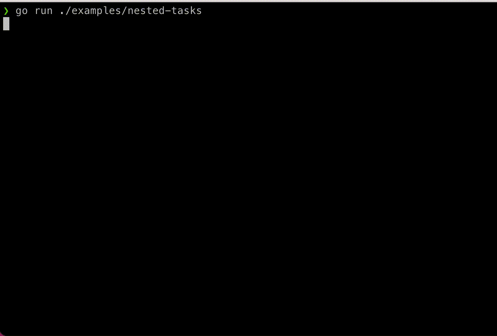

# golist Examples

A few examples demonstrating some of the features of `golist` in action:

## [hello-world](./hello-world/main.go): Basic `golist` quickstart

## [nested-tasks](./nested-tasks/main.go): Grouping tasks into subgroups, hiding tasks when not running, and running groups concurrently

## [task-skips-and-errors](./task-skips-and-errors/main.go): Skipping tasks and stopping if an error is returned

## [update-task-message](./update-task-message/main.go): Using the `TaskContext` argument to update the task's message while running

## [truncate-messages](./truncate-messages/main.go): Trimming the task's message if it's too long

=

## [print-while-running](./print-while-running/main.go): Safely printing to the terminal while the task list is displaying

